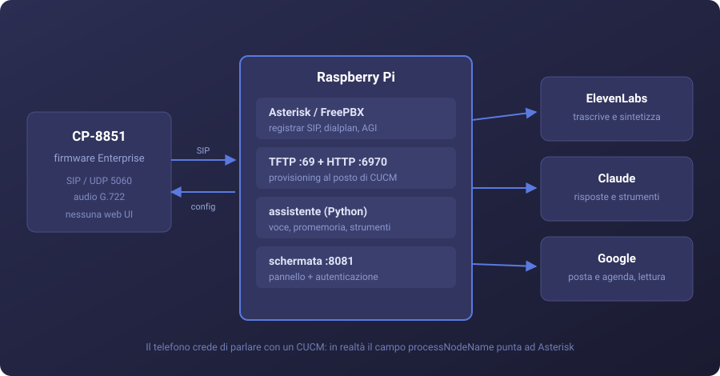

<h1 align="center">Cisco 8851 · AI Assistant</h1>

<p align="center">
  <sub>
    CP-8851 firmware Enterprise 14.3 · Asterisk 18 / FreePBX 15 · Raspberry Pi ·
    SIP/UDP · G.722 16&nbsp;kHz · Python 3.7 stdlib
  </sub>
</p>

<p align="center">
  <sub>Progetto personale, fatto per hobby. Non è un prodotto e non ha supporto.</sub>
</p>

<p align="center">
  
</p>

Provisioning di un telefono IP Cisco con firmware **Enterprise** verso un
registrar SIP arbitrario, **senza CUCM e senza conversione a firmware MPP**, e
integrazione di un assistente vocale nel dialplan Asterisk.

Il firmware Enterprise parla SIP standard ma non espone alcuna interfaccia di
configurazione: scarica l'intera configurazione via TFTP/HTTP all'avvio e la
linea SIP contiene `<proxy>USECALLMANAGER</proxy>`, che risolve al nodo
dichiarato in `callManagerGroup`. Puntando `processNodeName` a un Asterisk, il
telefono emette un REGISTER conforme e si registra. Nessun exploit, nessuna
licenza aggirata.

Sopra a questo: AGI che chiude il ciclo voce→testo→modello→voce con
interruzione vocale via `BackgroundDetect`, strumenti per promemoria e API
Google, e un pannello informativo servito come `CiscoIPPhoneImageFile`.

**Numeri**: ~1&nbsp;s per un turno senza strumenti, ~8&nbsp;s con una chiamata
alle API Google. Catena audio interamente a 16&nbsp;kHz.

<table>
<tr>
<td width="50%" valign="top">

<p align="center"><sub><code>CiscoIPPhoneImageFile</code> generato con PIL — dati e marchio di esempio</sub></p>
</td>
<td width="50%" valign="top">

<p align="center"><sub><code>defaultWallpaperFile</code> 800×480 — <code>BRAND</code> e logo sono configurabili</sub></p>
</td>
</tr>
</table>

## Cosa fa

| | |
|---|---|
| **Telefonia** | interno SIP registrato, chiamate interne, segreteria |
| **Assistente vocale** | interno `500`, contesto mantenuto per la durata della chiamata |
| **Promemoria** | strumenti esposti al modello; consegna via `channel originate` da cron |
| **Posta e agenda** | Gmail e Calendar in lettura, bozze in scrittura. Invio non raggiungibile dal codice |
| **Schermata** | `defaultWallpaperFile` + pannello su `servicesURL` |

## La catena vocale

```
Asterisk registra la voce (16 kHz)
   → ElevenLabs Scribe trascrive
   → Claude risponde, con strumenti (promemoria, Gmail, Calendar)
   → ElevenLabs sintetizza
   → Asterisk riproduce
```

Durante l'elaborazione un thread separato lavora mentre il principale riproduce
riempitivi **selezionati in base allo strumento in uso** — "Controllo l'agenda"
mentre interroga Calendar. Il silenzio su una linea telefonica è
indistinguibile da una chiamata caduta.

## Su cosa gira

Le versioni effettivamente usate. Niente è vincolante tranne dove indicato.

| | |
|---|---|
| **Hardware** | Raspberry Pi 400 — 4 core, 4 GB. Va bene qualsiasi cosa sempre accesa |
| **Telefono** | Cisco CP-8851, firmware Enterprise 14.3(1) |
| **Sistema** | Raspbian 10 (buster), armv7l ⚠️ |
| **Centralino** | Asterisk 18.26.3 + FreePBX 15.0.37 |
| **Python** | 3.7.3 — **solo libreria standard**, nessuna dipendenza pip |
| **Provisioning** | tftpd-hpa 5.2 + `python3 -m http.server` |
| **Audio** | sox 14.4.2, espeak-ng 1.49.2 (ripiego se la sintesi cloud non risponde) |
| **Immagini** | python3-pil 5.4.1 — sfondo e pannello |

⚠️ **Buster è end-of-life**: nessun aggiornamento di sicurezza. Per un progetto
domestico va bene; se ci passano telefonate aziendali, la macchina va rifatta su
una distribuzione supportata prima di appoggiarci il lavoro vero.

Il codice usa **HTTP diretto** verso le API invece degli SDK ufficiali: l'SDK
Anthropic richiede Python 3.10 e Buster si ferma a 3.7. Su un sistema più
recente si può usare l'SDK senza cambiare la struttura.

### Servizi esterni

| | |
|---|---|
| **ElevenLabs** | trascrizione (`scribe_v2`) e sintesi (`eleven_multilingual_v2`) |
| **Anthropic** | risposte e uso degli strumenti; modello configurabile |
| **Google** | Gmail e Calendar in lettura, bozze in scrittura |

## Struttura

```
phone/       configurazione che il telefono scarica via TFTP
server/agi/  codice Python: assistente, promemoria, API Google, schermata
server/      dialplan Asterisk, unit systemd, cron
scripts/     autorizzazione Google, generatore sfondo
docs/        guida passo passo e trappole incontrate
```

## Da dove iniziare

0. [docs/00-come-funziona.md](docs/00-come-funziona.md) — **leggi questo per
   primo**: come funziona davvero il provisioning di un telefono Cisco e come si
   fa a farne a meno di CUCM. Capito quello, il resto sono dettagli.
1. [docs/01-telefono.md](docs/01-telefono.md) — la procedura. **È la parte
   difficile**: senza questa non c'è nient'altro.
2. [docs/02-server.md](docs/02-server.md) — Asterisk, TFTP, HTTP
3. [docs/03-assistente.md](docs/03-assistente.md) — la voce
4. [docs/04-promemoria.md](docs/04-promemoria.md) — promemoria che ti telefonano
5. [docs/05-schermata.md](docs/05-schermata.md) — sfondo e pannello
6. [docs/06-google.md](docs/06-google.md) — Gmail e Calendar, e il confine anti-invio
7. [docs/07-gestione.md](docs/07-gestione.md) — avviare, controllare, diagnosticare
8. [docs/99-trappole.md](docs/99-trappole.md) — **da leggere se qualcosa non va**

## Segnaposto da sostituire

Nessun valore reale è versionato. Nei file trovi:

| Segnaposto | Cosa metterci |
|---|---|
| `__PBX_IP__` | IP del Raspberry Pi |
| `__PHONE_IP__` | IP del telefono |
| `__GATEWAY_IP__` | IP del router (usato come server orario) |
| `__MAC__` | MAC del telefono, maiuscolo, senza separatori |
| `__SIP_PASSWORD__` | password dell'interno SIP |
| `__NOME__`, `__DISPLAY_NAME__` | etichette mostrate a schermo |
| `__AZIENDA__` | intestazione in cima al display, max 12 caratteri |

Le credenziali non sono versionate. Il modello del file di configurazione è in
`server/assistant-keys.conf.example`; dove collocarlo e con quali permessi è
spiegato in [docs/02-server.md](docs/02-server.md).

## Costi

- **ElevenLabs**: consuma crediti sia per trascrivere sia per sintetizzare
- **Claude**: modello configurabile in `assistant_lib.py`. Con Haiku il costo per
  scambio è trascurabile
- **Google**: gratuito entro le quote normali

## Sicurezza

L'assistente **non può inviare email**, e questo non dipende dalle istruzioni
date al modello. `google_api.py` ha una lista di endpoint ammessi (sole letture
più creazione bozze) e un filtro che rifiuta comunque qualsiasi percorso
contenente `send`, `trash` o `delete`. Un'istruzione si può disattendere, una
lista di permessi no.

Google non offre uno scope "solo bozze": `gmail.compose` concede bozze **e**
invio. La garanzia viene quindi dal codice, non dal permesso OAuth.

## Foto

`docs/img/` contiene il diagramma e le schermate generate. Le foto del telefono
vero — schermo acceso, tasti, apparecchio sulla scrivania — vanno aggiunte lì e
richiamate da questo README: sono la cosa che rende evidente a colpo d'occhio di
cosa si sta parlando.

---

## English summary

Provisioning a **Cisco CP-8851** running **Enterprise firmware** against an
arbitrary SIP registrar — no CUCM, no paid MPP conversion — plus a voice
assistant wired into the Asterisk dialplan.

Enterprise firmware speaks standard SIP but exposes no configuration UI: it
pulls its whole configuration over TFTP/HTTP at boot, and the SIP line carries
`<proxy>USECALLMANAGER</proxy>`, which resolves to the node declared in
`callManagerGroup`. Point `processNodeName` at an Asterisk box and the phone
emits a conformant REGISTER. No exploit, no licence bypass.

On top: an AGI closing the speech→text→model→speech loop with voice barge-in via
`BackgroundDetect`, tool calls for reminders and Google APIs, and an info panel
served as `CiscoIPPhoneImageFile`. Roughly 1 s per turn without tool use, 8 s
with a Google round trip; 16 kHz end to end.

Drafting emails is available, **sending is not** — enforced by an endpoint
allowlist in `google_api.py`, not by prompt instructions, since Google offers no
drafts-only OAuth scope.

Docs are in Italian. `docs/00-come-funziona.md` covers the provisioning model,
`docs/07-gestione.md` day-to-day operation, `docs/99-trappole.md` every trap hit
along the way — none of which produced a useful error message.

---

## Disclaimer

Progetto per hobby, messo insieme in un pomeriggio per rimettere in uso un
telefono che sarebbe finito in un cassetto. Non è un prodotto, non c'è supporto,
non c'è garanzia.

Qualche cosa da sapere se lo replichi:

- Funziona sulla versione di firmware indicata. Cisco può cambiarla e non ha
  promesso niente a nessuno.
- `deviceSecurityMode` non sicuro vuol dire che chi risponde al posto del server
  di provisioning può riconfigurare il telefono. In casa va bene, in azienda no.
- Il sistema operativo usato è end-of-life. Vale lo stesso discorso.
- Ogni scambio vocale consuma crediti. Poco, ma non zero, e un ciclo infinito
  li brucia in fretta.
- Il telefono non viene modificato: nessun firmware toccato, nessuna licenza
  aggirata. Un reset di fabbrica lo riporta com'era.

Cisco e i nomi dei prodotti citati appartengono ai rispettivi proprietari,
nessuna affiliazione. Il template di configurazione viene da
[usecallmanagernz/tftpboot](https://github.com/usecallmanagernz/tftpboot)
(CC BY 4.0).
